# Podcast Website 

As Winston Churchill:

> Success is walking from failure to failure
>  with no loss of enthusiasm.
### Description
SoundUs website where you can have your own channel and ability to upload audio of your own . Podcast website offer Subscription other channels and interact with them in efficient and effective way . Enjoy the journey

### Website

https://podcast-titanum.herokuapp.com/

### Wireframes

Wireframes

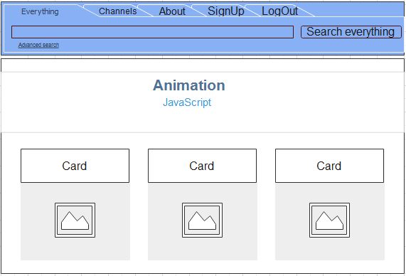

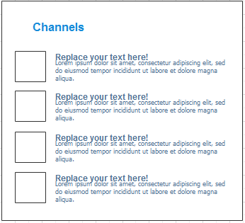
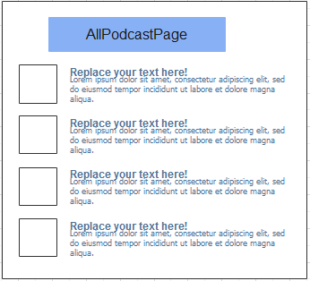
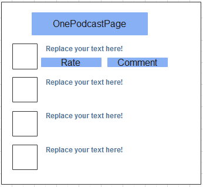
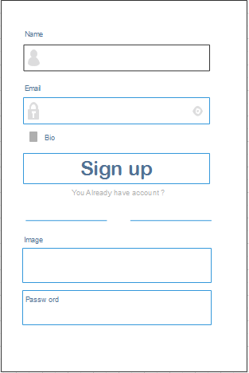
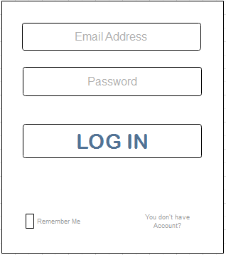
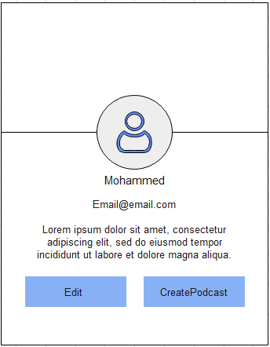
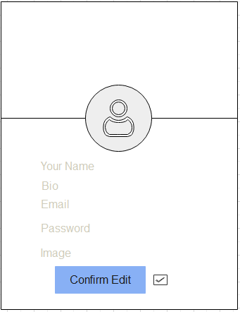
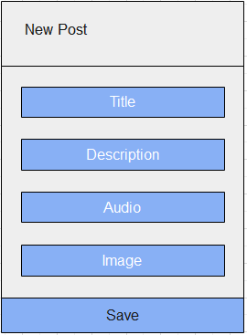
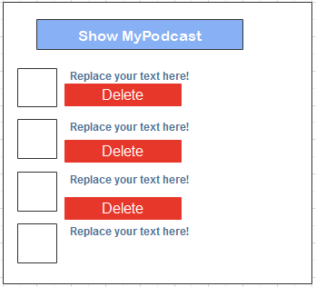

### Built With
 

* [MongoDB,Mongoose](https://www.mongodb.com/)
* [Node.js](https://nodejs.org)
* [Express.js](https://expressjs.com)
* [React](https://ar.reactjs.org)

### User Stories
* User will signup , login and logout
* Authorized User can show all channels and have profile 
* Authorized User can subscribe the channel and have subscriptions page
* Authorized can create it's own podcast
* Authorized User can either upload audio or record audio
* Authorized User can Add comments and rate others podcasts
* Authorized User can have edit profile and change password safely
* Authoriized User can delete podcast 

### Planning and Development Process

Development Process

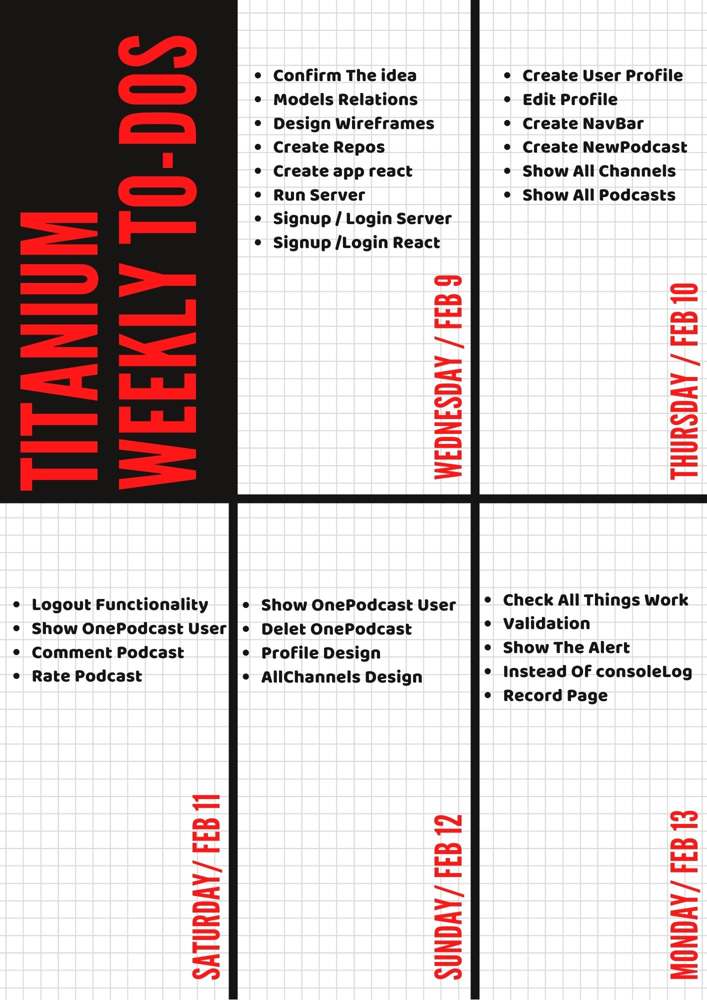

### Problem-Solving Strategy
* Upload audio and record using API
* Refresh page problem of react using if statment
* Image url using API

### Acknowledgments
* Ali King of creative solutions 
* Yasir King of css
 ### References
* [W3school](https://www.w3schools.com/)
* [Stackoverflow](https://stackoverflow.com/)

